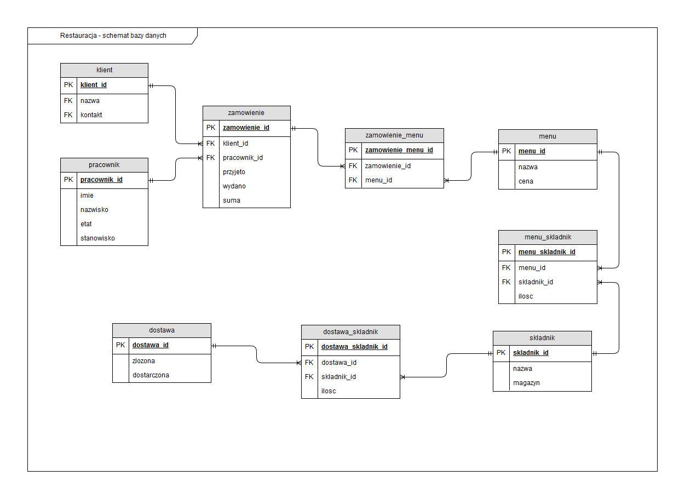

# Database projects
Unfortunately databases are in Polish language, it was requirement by teachers.  
Databases was projected for school, so it's simplified somehow, it's obvious that in business environment it will become more complex.

* [Agencja interaktywna](./Agencja interaktywna) (PostgreSQL) - database project for advertising  agency.
* [Przypisanie wykładowców](./Przypisanie wykładowców) (MySQL) - database for school, allow assign teachers to lessons.
* [Restauracja](./Restauracja) (PostgreSQL) - database for restaurant.

# Screens

